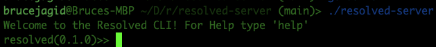
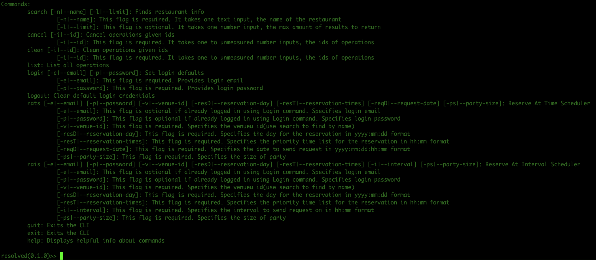
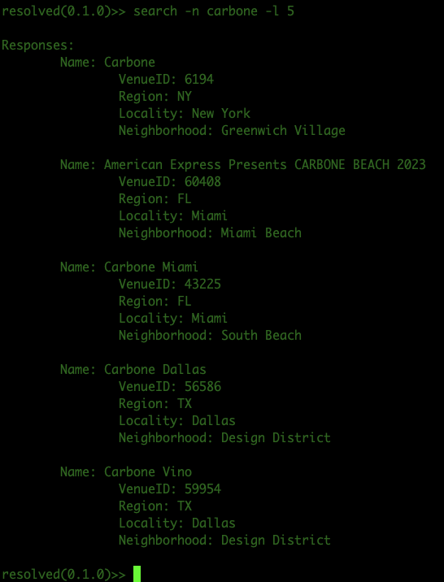
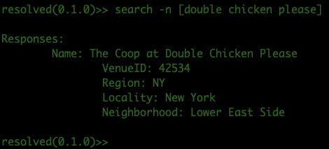
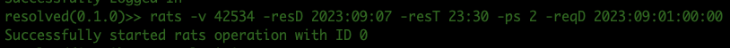

# resolved-bot
## Description
Resolved is a combination of the following:
1. A go API to resy
2. An application on top of the API that can perform concurrent tasks such as repeating a reservation request at differing time intervals or scheduling a reservation request until a specified reservation drop date
3. A command prompt interface to the application
4. An HTTP server interface to the application

So far, items 1-3 are implemented, with future plans in the issues section labelled "enhancements"

## Steps to build:

1. Install the go programming language, this can be done by searching "golang installation"
2. clone this repository
3. run `go build` in root directory of project

If you would like to test new features, the `develop` branch is a decently tested staging area for new 
feautres, usually 3 features ahead of `main`.

## How to use:

On a successful start up, one should be prompted with the CLI welcome message:

Typing `help` yields:

I'll explain each command, but not in the order they appear:
1. `search` takes in one required input, the name of restuarant you want to search for, and one optional input, a number to limit the results by. The name of the restaurant is specified with the `-n` flag(or alternatively the `--name` flag) and the limit is specified with the `-l`(alternatively `--limit`) flag.

Here is an example use of a search using a name of carbone and limit of 5: 

What if the restaurant name has spaces? Just wrap it in square brackets. In this next example, we'll search for "double chicken please":

The purpose of searching is to obtain the `VenueID`. This number is a unique identifier that resy uses to find the restaurant that you want to reserve at, since multiple restaurants can have the same name.

2. `login` takes in two required inputs, the email(`-e` flag) and password(`-p` flag) associated with your resy login. It then checks to see if these inputs are a valid login to resy. This command is useful if you intend to use any other command that has an email and password, as these will be used as defaults
3. `logout` clears the defaults set by a login if you want to erase your credentials from the system
4. `rats` is one of the two core function commands of the bot(the other being `rais`). Its main use is to schedule a time to try to get a reservation at. For example, some restaurants will only release available seating for a given day six days before. So if I want to reserve an 11 PM on the 7th, I have
to be one of the lucky few who press "reserve" fast enough on the 1st. `rats` will automate this task for you.

Here is an example use:

I'll walk through what each flag does:
1. `-v` or `--venue-id` specifies the unique identifier for which we want to make a reservation. We're using double chicken please's id from the search example.
2. `-resD` or `--reservation-day` specifies the day that we want our reservation at in yyyy:mm:dd format. In this case, we're setting the day to be september 7th, 2023
3. `-resT` or `--reservation-times` specifies the military style times we want to make our reservation at in hh:mm format and in order of priority. In this case, we only have one time, but we could list as many times as we want in that area, and if the first n fail, it will try the n+1th
4. `-ps` or `--party-size` specifies the party size, in this case 2 people
5. `-reqD` or `--request-date` specifies the date at which we want to make the request(basically the date we want to press the "reserve" button at). This should be supplied in military time, with format yyyy:mm:dd:hh:mm (year:month:day:hour:minute). In this case, we want to press
"reserve" at midnight on september 1st, 2023.

Other flags include a `-e` flag for email and `-p` for password, but if logged in this is not needed(actually if you are logged in but don't want to use the login credentials you used in the login command, specifying `-e` and `-p` flags here will override those credentials for this command)
The output of this command on success is an ID number. This can be used in later commands to see the status(whether it failed or succeeded) or to cancel the operation.

5. `rais` is one of the two core function commands of the bot(the other being `rats`). Its main use is to try to make a reservation at a repeating interval.

The inputs are very similiar to `rats`:
1. `-v` or `--venue-id` specifies the unique identifier for which we want to make a reservation. 
2. `-resD` or `--reservation-day` specifies the day that we want our reservation at in yyyy:mm:dd format.
3. `-resT` or `--reservation-times` specifies the military style times we want to make our reservation at in hh:mm format and in order of priority. 
4. `-ps` or `--party-size` specifies the party size, in this case 2 people
5. `-i` or `--interval` specifies the interval to repeat on in hh:mm format. So, if we used all the same parameters for the previous example with `-i 00:01`, then this command would try to make an 11:30 PM reservation at double chicken please for september 7th, 2023, and the bot would perform this request every minute (00 for hour, 01 for minute)

Here are the last remaining commands:

6. `cancel` takes in a list of ids using the `-i` flag and tries to cancel the operation associated with each id. In the rats example, the operation has id 0, so calling `cancel -i 0` will cancel the rats operation
7. `list` takes in no input and outputs a list of each operation's id, its status(failed, succeeded, cancelled, etc.) and the result(error if failed, reservation time if succeeded)
8. `clean` takes in a list of ids using the `-i` flag and will remove the operation information from the system(i.e. it will no longer be displayed from the list command). Operations can only be cleaned once they are no longer in progress.
9. `exit/quit` leaves the prompt
10. `help` outputs helpful information about each command

## How To Contribute

I am open and happy to accept contributions from anyone who wants to offer them. To get started on this, read the `Contribution Etiquette` post in the issue section of this project, which should be pinned. Another document which might be helpful in getting adjusted to the project is the `Architecture Overview` issue post, which provides an overhead view to what each part of the codebase does. Generally, any helpful information can be found in the issue section labelled with `information`. I'm avaialble at `brucejagid@gmail.com`; feel free to send any questions to that address.
